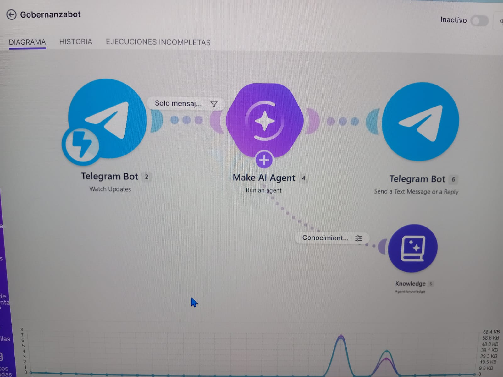

# Chatbot Educativo de Gobernanza Ambiental

Este proyecto implementa un asistente virtual inteligente en Telegram integrado con **Make.com** y **Make AI Agent (Anthropic Claude)**[cite: 2]. El chatbot actúa como un tutor especializado para la asignatura de *Desarrollo Sustentable (ACD-0908)* del Tecnológico Nacional de México, campus Mazatlán[cite: 2], respondiendo dudas basándose exclusivamente en una base de conocimiento (*Knowledge Base*) compuesta por 6 documentos sobre Gobernanza Ambiental y Economía Circular[cite: 2].

---

## Material utilizado

* **Telegram Bot API:** Interfaz de mensajería para interacción con los estudiantes gestionada mediante `@BotFather`[cite: 2].
* **Make.com:** Plataforma de automatización *serverless* para la orquestación del flujo[cite: 2].
* **Make AI Agent / Anthropic Claude API:** Modelo de lenguaje generativo configurado para arquitectura RAG (*Retrieval-Augmented Generation*)[cite: 2].
* **Base de Conocimiento (Knowledge Base):** 6 documentos en formato PDF especializados en Gobernanza Ambiental y Economía Circular[cite: 2].
* **Filtros de control de flujo:** Módulo de validación de entradas de texto en Make[cite: 2].

---

## Diagrama del circuito

---

## Configuración del Agente IA (System Prompt)

El comportamiento del modelo Claude dentro del módulo **Make AI Agent** se delimitó mediante las siguientes instrucciones estrictas[cite: 2]:

> Eres un asistente educativo especializado exclusivamente en el tema de Gobernanza Ambiental, para alumnos del curso Desarrollo Sustentable (ACD-0908) del Tecnológico Nacional de México, campus Mazatlán[cite: 2].
> 
> Debes responder ÚNICAMENTE con base en la información contenida en los archivos PDF que se te proporcionan en la base de conocimiento[cite: 2]. No debes usar conocimiento externo, no debes inventar información, y no debes buscar en internet[cite: 2].
> 
> Responde siempre en español, en un máximo de 3 a 4 líneas (60-80 palabras aproximadamente)[cite: 2]. Sé directo y claro, sin explicaciones largas ni ejemplos adicionales, salvo que el alumno pida explícitamente más detalle[cite: 2].
> 
> Si la pregunta del alumno NO se puede responder con la información del PDF, responde exactamente[cite: 2]:  
> *"No cuento con información suficiente en el documento para responder esa pregunta. Mi función es exclusivamente resolver dudas sobre gobernanza ambiental con base en el material del curso."*[cite: 2]

---

## Capturas de pantalla

---

## Reporte Técnico

**1. Resumen Ejecutivo**  
El presente reporte documenta el desarrollo e implementación de un chatbot educativo interactivo en Telegram para la materia de Desarrollo Sustentable[cite: 2]. La solución utiliza un esquema de Generación Aumentada por Recuperación (RAG) mediante **Make AI Agent**[cite: 2], restringiendo las respuestas del modelo de inteligencia artificial exclusivamente a un acervo de 6 documentos PDF sobre Gobernanza Ambiental y Economía Circular[cite: 2]. Esta arquitectura garantiza precisión académica, elimina las alucinaciones del LLM y minimiza el uso ineficiente de cómputo en la nube.

**2. Planteamiento del Problema**  
En el ámbito educativo, las consultas sobre marcos normativos, economía circular y gobernanza ambiental suelen requerir la lectura de extensos documentos técnicos. El uso desmedido de modelos de lenguaje de propósito general sin restricciones de contexto genera respuestas imprecisas o excesivamente largas que incrementan el consumo de tokens y energía en servidores remotos. Existía la necesidad de crear un canal directo e inmediato que resuelva dudas puntuales sin salirse del programa del curso[cite: 2].

**3. Arquitectura del Sistema**  
La arquitectura del sistema sigue un patrón basado en eventos (*Event-Driven Architecture*) dividido en tres capas principales:

* **Capa de Interacción (Telegram Bot):** Captura en tiempo real los mensajes enviados por los alumnos mediante el módulo *Watch Updates*[cite: 2].
* **Capa de Control y Validación (Make Filter):** Un filtro intermedio (`Message: Text Exists`) evalúa la carga útil para descartar archivos no textuales antes de procesarlos[cite: 2].
* **Capa de Razonamiento RAG (Make AI Agent + Knowledge Base):** El agente procesa la pregunta consultando únicamente los documentos PDF cargados en la base de conocimiento[cite: 2].
* **Capa de Respuesta (Telegram Bot):** Devuelve la respuesta sintetizada mediante el módulo *Send a Text Message or a Reply* directamente al chat privado del alumno[cite: 2].

**4. Flujo de Datos**  
1. El estudiante envía un mensaje de texto al bot de Telegram[cite: 2].
2. El módulo **Telegram Bot (Watch Updates)** recibe la notificación vía Webhook[cite: 2].
3. El filtro **Solo mensajes de texto** valida que la entrada contenga texto[cite: 2].
4. El **Make AI Agent** recibe el texto y consulta la **Knowledge Base**[cite: 2].
5. El agente sintetiza una respuesta de máximo 4 líneas basada en los documentos[cite: 2].
6. El módulo **Telegram Bot (Send a Text Message or a Reply)** envía la respuesta al usuario[cite: 2].

**5. Evaluación de Impacto (Green IT)**  
La implementación de esta solución se alinea con las mejores prácticas de **Green IT** bajo tres criterios:

* **Arquitectura Serverless:** No requiere mantener un servidor dedicado encendido 24/7 en espera de peticiones, ejecutando el cómputo únicamente ante la llegada de un mensaje[cite: 2].
* **Filtrado Eficiente de Entradas:** Filtrar mensajes vacíos o no textuales en el middleware previene el gasto innecesario de tokens e infraestructura de inferencia[cite: 2].
* **Acotamiento de Respuestas:** Limitar las respuestas a un máximo de 80 palabras reduce significativamente el procesamiento del LLM[cite: 2], disminuyendo la energía consumida por token generado en los centros de datos.

**6. Conclusiones**  
Se logró desplegar con éxito un asistente virtual preciso y de bajo impacto ambiental para la asignatura de Desarrollo Sustentable[cite: 2]. La integración de Telegram con Make AI Agent y la base de conocimiento especializada demuestra que es posible desplegar soluciones educativas avanzadas respaldando los principios de sostenibilidad tecnológica, optimización de recursos e inteligencia artificial responsable[cite: 2].
